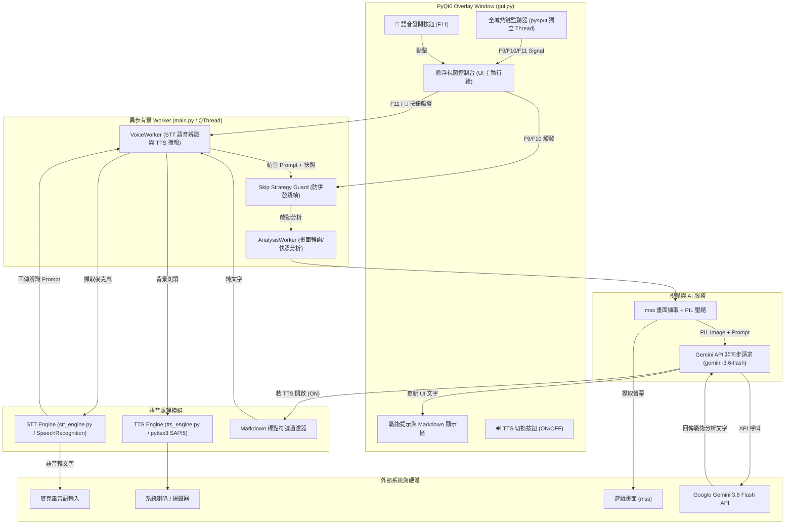

# Gemini 遊戲即時視覺輔助助手 (Real-time Vision AI Game Assistant) 實作計畫 (語音 TTS / STT 功能擴充版)

本計畫詳細規劃基於 **Gemini 3.6 Flash** 的即時遊戲視覺輔助助手之軟體架構、組件設計、開發步驟與驗證標準，並全面整合「離線語音朗讀 (pyttsx3 TTS)」與「語音指令輸入 (Speech Recognition STT)」雙向語音互動功能。

---

## 1. 目標描述與背景 (Target Description & Background)

### 1.1 專案背景
在現代複雜的電子遊戲（如魂類動作遊戲、即時戰略、RPG 養成、解謎冒險、米哈遊系列《原神》、《崩壞：星穹鐵道》、《絕區零》等）中，玩家在緊張戰鬥或複雜解謎時，往往無暇閱讀視窗上的文字攻略或手動打字發問。

### 1.2 專案目標
打造一個**輕量級、即時、無縫、支援語音雙向互動**的桌面視覺輔助工具：
- **置頂懸浮視窗 (Overlay UI)**：提供直覺的介面，支援透明度調整、一鍵收合，並新增 🔊 語音朗讀切換與 🎤 語音發問控制。
- **全域熱鍵控制與 UI 雙軌操作**：
  - `F9`：切換自動輪詢 / 暫停。
  - `F10`：手動畫面快照分析。
  - `F11`：觸發麥克風語音錄音與辨識（STT）。
- **即時視覺與語音雙向分析**：
  - **STT 語音指令輸入 (`stt_engine.py`)**：玩家按下 F11 或點擊 🎤 按鈕，即可透過麥克風口述問題（例如：「這隻 Boss 的招式怎麼躲？」、「這個解謎方碑怎麼開？」），系統自動辨識並結合當前遊戲畫面傳送給 `gemini-3.6-flash` 進行客製化解答。
  - **TTS 離線語音朗讀 (`tts_engine.py`)**：基於 Windows SAPI5 (`pyttsx3`)，當 AI 分析結果回傳時，自動過濾 Markdown 標點與代碼符號，於背景執行緒語音朗讀戰術建議，讓玩家「用聽的」掌握戰況。

### 1.3 系統架構概覽

---

## 2. 預期變更與檔案清單 (Files & Components)

本專案位於 `D:\work\workspace\game-assistant`，遵循 **Simplicity First (YAGNI)** 原則與模組化職責分離：

| 檔案路徑 | 變更類型 | 職責與描述 |
| :--- | :--- | :--- |
| `tts_engine.py` | `NEW` | **離線 TTS 語音朗讀模組**。封裝 `pyttsx3` (Windows SAPI5)，支援語速/音量調整、中文語音包切換、 Markdown 標點與代碼區塊過濾。 |
| `stt_engine.py` | `NEW` | **STT 語音指令輸入模組**。基於 `SpeechRecognition` 擷取麥克風音訊，支援音量門檻校正、超時處理與繁體中文 (zh-TW) 辨識。 |
| `config.py` | `MODIFY` | 擴充 F11 熱鍵 (`HOTKEY_VOICE_PROMPT`)、TTS 預設參數 (語速 180, 音量 1.0, 預設開啟)、STT 預設語言與逾時設定。 |
| `ai_engine.py` | `MODIFY` | 擴充 `analyze_image` 方法，支援接收自訂語音 Prompt (`custom_prompt`) 並結合當前遊戲類型與模式發送給 Gemini。 |
| `gui.py` | `MODIFY` | 擴充 PyQt6 Overlay 介面，新增 🔊 TTS 開關切換按鈕、🎤 語音指令按鈕與麥克風錄音/辨識狀態提示欄 (如「🎤 聆聽中...」)。 |
| `main.py` | `MODIFY` | 新增 `VoiceWorker(QThread)` 負責背景語音辨識與 TTS 播報，整合 F11 熱鍵與 GUI 按鈕訊號連動，確保 UI 零卡頓。 |
| `requirements.txt` | `MODIFY` | 擴充套件依賴：`pyttsx3>=2.90`, `SpeechRecognition>=3.10.0`, `PyAudio>=0.2.14`。 |
| `README.md` | `MODIFY` | 更新 README 文檔，新增 TTS / STT 語音功能說明、麥克風與 SAPI5 系統需求以及 F11 熱鍵操作指南。 |

---

## 3. 變更步驟與實作階段 (Implementation Steps)

### Phase 2: TTS 離線語音朗讀模組與 COM 線程防護 (`tts_engine.py`)
1. **設計 `TTSEngine` 類別**：
   - Windows COM 執行緒安全：在背景 Worker 線程中調用 SAPI5 前，必須導入 `pythoncom` 並執行 `pythoncom.CoInitialize()`，任務結束後於 `finally` 區塊執行 `pythoncom.CoUninitialize()`，杜絕 PyQt `QThread` 中的 COM `RPC_E_WRONG_THREAD` 崩潰。
   - 使用 `pyttsx3.init('sapi5')` 初始化，優先選擇繁體/簡體中文語音包 (如 `HanHan`, `Yating`, `HuiHui` 或中文 SAPI5 語音)。
2. **實作 Markdown 標點符號過濾 (`clean_markdown_for_tts`)**：
   - 使用正則表達式過濾 `#`, `*`, `**`, `__`, `` ` ``, `> `, `[title](url)`, `| table |`, `Mermaid` 程式碼區塊以及 URL。
   - 將連續空白或換行壓縮為單一空格/停頓，確保朗讀流暢自然。

### Phase 3: STT 語音指令輸入模組與硬體防暴 (`stt_engine.py`)
1. **設計 `STTEngine` 類別**：
   - 使用 `speech_recognition.Recognizer()` 與 `speech_recognition.Microphone()`。
   - **嚴密硬體與邊界例外防護**：
     - 使用 `try-except (OSError, sr.RequestError, sr.UnknownValueError, sr.WaitTimeoutError, Exception)` 包裹全過程。
     - 若無麥克風、驅動無效或 PyAudio 拋出 `OSError` (Errno -9996)，抓取例外並回傳「未檢測到可用麥克風設備」友善訊息，絕不拋出未捕獲例外導致程式崩潰。
   - 實作 `listen_and_recognize()`：
     1) `adjust_for_ambient_noise(source, duration=0.5)` 自動校正環境噪音門檻。
     2) 擷取麥克風音訊，設置 `timeout=5` 與 `phrase_time_limit=8`。
     3) 呼叫 `recognize_google(audio, language=STT_LANGUAGE)` 進行中文辨識。

### Phase 4: Gemini AI 引擎語音 Prompt 擴充 (`ai_engine.py`)
1. **擴充 `analyze_image` 介面**：
   - 增加可選參數 `custom_prompt: Optional[str] = None`。
2. **Prompt 組合邏輯**：
   - 若傳入 `custom_prompt`（即玩家發問的語音文字），優先將其作為核心發問：
     > 「玩家提出了關於畫面的具體問題：【{custom_prompt}】。請結合當前遊戲畫面與遊戲類型 ({game_type})，給出精準且直接的解答與戰術指引。請以繁體中文回答。」
   - 若未傳入 `custom_prompt`，則維持預設的 `PROMPTS[game_type][analysis_mode]` 模式。

### Phase 5: PyQt6 GUI 懸浮面板擴充 (`gui.py`)
1. **懸浮工具列按鈕擴充**：
   - 新增 `btn_tts_toggle` (🔊 語音朗讀: ON / OFF 切換按鈕)。點擊切換狀態並更新圖示/顏色。
   - 新增 `btn_voice_prompt` (🎤 語音指令 [F11] 按鈕)。點擊時觸發語音發問流程。
2. **狀態指示欄與按鈕狀態復原**：
   - 增加語音狀態動態提示：如 「🎤 聆聽中... 請講話」、「語音辨識中...」、「🔊 語音播報中...」。
   - 錄音結束或發生例外時，確保 UI 自動將按鈕狀態復原，不得卡住或無法再次點擊。

### Phase 6: 主程式異步架構與 Worker 職責分離 (`main.py`)
1. **獨立 Worker 架構 (分離 STT 與 TTS 防止死鎖)**：
   - **`STTWorker(QThread)`**：專責獨立處理麥克風錄音與語音轉文字辨識。具備 `_is_stt_running` 狀態鎖防連打。辨識完成後觸發「擷取畫面 + 傳送語音 Prompt 至 Gemini」。
   - **`TTSWorker(QThread)`**：專責獨立處理離線語音播報。包含 `pythoncom.CoInitialize()`，在背景執行 `tts_engine.speak()`。當有新分析結果產生時，能主動呼叫 `stop()` 停止舊播報並播放新內容。
2. **全域熱鍵 F11 綁定**：
   - 更新 `pynput` 熱鍵監聽器，新增 `F11` 按鍵監聽。
   - 按下 F11 時觸發 `STTWorker`，並透過 `pyqtSignal` 更新 UI 狀態。

### Phase 7: 文檔更新與測試 (`README.md`, 測試)
1. **更新 `README.md`**：說明 TTS / STT 語音功能使用方法、麥克風權限注意事項與 Windows SAPI5 語音套件設定。
2. **極端條件驗證**：
   - 無麥克風設備或麥克風被停用時的防爆處理。
   - 麥克風錄音逾時 (未發聲) 處理。
   - 長文戰術分析下的 TTS 播報中斷與語速控制。

---

## 4. 完成標準 (Done Criteria)

1. **套件依賴與模組完整性**：
   - [ ] `D:\work\workspace\game-assistant` 下新增 `tts_engine.py`, `stt_engine.py` 並更新 `config.py`, `ai_engine.py`, `gui.py`, `main.py`, `requirements.txt`, `README.md`。
   - [ ] `pip install -r requirements.txt` 可順利安裝 `pyttsx3`, `SpeechRecognition`, `PyAudio` 無衝突。

2. **TTS 離線語音朗讀模組 (`tts_engine.py`)**：
   - [ ] 成功使用 Windows SAPI5 進行繁體/簡體中文離線語音朗讀。
   - [ ] 正確執行 Markdown 標點符號、代碼區塊與 URL 移除，朗讀內容流暢無雜音。
   - [ ] 支援語速 (`TTS_RATE`) 與音量 (`TTS_VOLUME`) 動態調整。

3. **STT 語音指令輸入模組 (`stt_engine.py`)**：
   - [ ] 成功調用麥克風擷取語音並精準轉換為中文文字。
   - [ ] 支援環境噪音自動校正與錄音逾時 (`timeout`) 友善處理。
   - [ ] 捕捉無麥克風、辨識失敗或網路異常等例外，系統不崩潰。

4. **PyQt6 GUI 與語音雙向操作**：
   - [ ] Overlay 面板成功加入 🔊 語音朗讀 ON/OFF 切換按鈕與 🎤 語音發問按鈕。
   - [ ] 能即時在 UI 狀態列顯示「🎤 聆聽中...」、「語音辨識中...」等提示訊息。

5. **全域熱鍵與異步執行緒架構 (UI 零卡頓)**：
   - [ ] 全域熱鍵 `F11` 能正確觸發語音錄音與辨識。
   - [ ] 語音錄音、STT 辨識、API 呼叫與 TTS 語音播報**完全於 `VoiceWorker` / `AnalysisWorker` (QThread) 背景執行**，UI 介面維持 60 FPS 且無「無回應」現象。
   - [ ] 辨識出的文字能成功做為自訂 Prompt，結合當前畫面由 `gemini-3.6-flash` 產生精準戰術解答，並於分析完成後自動進行 TTS 背景朗讀（若 TTS 為 ON）。
